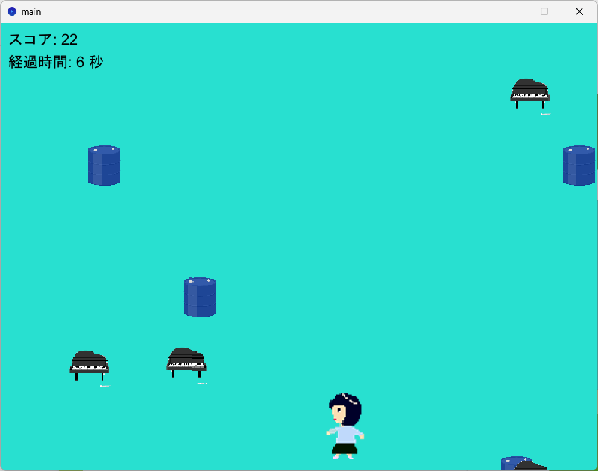

# team10
ソフトウェア工学演習
栗栖知史
徳永瑛之
吉田雅咲

「回避ゲーム」
・キャラを左右に動かして上から落ちてきて障害物をよけるゲームです
・障害物をよけるたびにスコアが上昇します
・障害物に当たったらゲームオーバーとなり、スコアが表示されます
・時間経過で障害物の量が増加していきます
・避け続けてハイスコアを目指そう

(操作方法)
・矢印キーでキャラを操作
・Vキーと矢印キーを同時に押すことでダッシュ
・Rキーでリスタート

